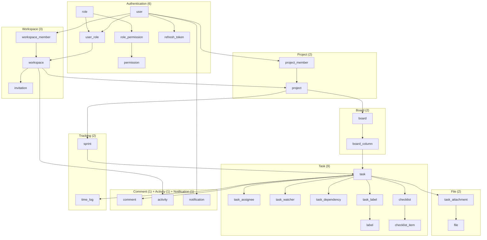
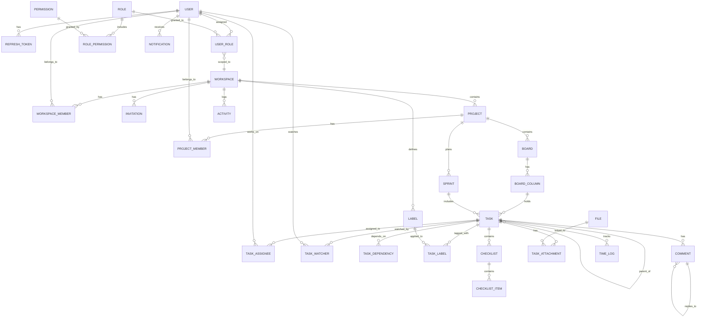

# TaskFlow — Final Database Architecture

> **Version**: 1.0
> **Date**: 2026-07-04
> **Status**: Approved — Ready for SQL generation
> **Total Tables**: 28

---

## Approved Decisions

| Decision | Status |
|---|---|
| Add `task_dependency` table | ✅ Accepted |
| Add `task_watcher` table | ✅ Accepted |
| Add `parent_comment_id` to `comment` | ✅ Accepted |
| Rename `task_activity` → `activity` (polymorphic) | ✅ Accepted |
| Add `workspace_id` to `user_role` | ✅ Accepted |
| Add `task.project_id` denormalization | ❌ Rejected |
| `notification_preference` table | ⏳ Postponed to V2 |
| `comment_reaction` table | ⏳ Postponed to V2 |
| `custom_field` + `custom_field_value` tables | ⏳ Postponed to V2 |
| `label` scoping | Workspace-scoped (default) |

---

## Module Overview

---

## Table Specifications

### Authentication Module (6 tables)

---

#### `user`

Core identity for every person in the system.

| Column | Type | Constraints | Notes |
|---|---|---|---|
| `id` | UUID | PK, DEFAULT gen_random_uuid() | |
| `email` | VARCHAR(255) | NOT NULL, UNIQUE | Login identifier |
| `password_hash` | VARCHAR(255) | NOT NULL | bcrypt/argon2 hash |
| `display_name` | VARCHAR(100) | NOT NULL | Shown in UI |
| `avatar_url` | TEXT | NULLABLE | Profile image URL |
| `is_active` | BOOLEAN | NOT NULL, DEFAULT true | Deactivate without soft-delete |
| `created_at` | TIMESTAMPTZ | NOT NULL, DEFAULT now() | |
| `updated_at` | TIMESTAMPTZ | NOT NULL, DEFAULT now() | |
| `deleted_at` | TIMESTAMPTZ | NULLABLE | Soft delete |

**Indexes**: UNIQUE on `email`

---

#### `role`

Named authorization roles: `owner`, `admin`, `member`, `viewer`.

| Column | Type | Constraints |
|---|---|---|
| `id` | UUID | PK |
| `name` | VARCHAR(50) | NOT NULL, UNIQUE |
| `description` | TEXT | NULLABLE |
| `created_at` | TIMESTAMPTZ | NOT NULL, DEFAULT now() |
| `updated_at` | TIMESTAMPTZ | NOT NULL, DEFAULT now() |

---

#### `permission`

Granular permission keys: `task:create`, `project:delete`, `board:edit`, etc.

| Column | Type | Constraints |
|---|---|---|
| `id` | UUID | PK |
| `key` | VARCHAR(100) | NOT NULL, UNIQUE |
| `description` | TEXT | NULLABLE |
| `created_at` | TIMESTAMPTZ | NOT NULL, DEFAULT now() |
| `updated_at` | TIMESTAMPTZ | NOT NULL, DEFAULT now() |

---

#### `user_role`

Bridge: assigns a role to a user **within a specific workspace**.

| Column | Type | Constraints |
|---|---|---|
| `id` | UUID | PK |
| `user_id` | UUID | FK → user, NOT NULL |
| `role_id` | UUID | FK → role, NOT NULL |
| `workspace_id` | UUID | FK → workspace, NOT NULL |
| `created_at` | TIMESTAMPTZ | NOT NULL, DEFAULT now() |

**Unique**: `(user_id, role_id, workspace_id)`
**ON DELETE**: All three FKs → CASCADE

---

#### `role_permission`

Bridge: which permissions a role grants.

| Column | Type | Constraints |
|---|---|---|
| `id` | UUID | PK |
| `role_id` | UUID | FK → role, NOT NULL |
| `permission_id` | UUID | FK → permission, NOT NULL |
| `created_at` | TIMESTAMPTZ | NOT NULL, DEFAULT now() |

**Unique**: `(role_id, permission_id)`
**ON DELETE**: Both FKs → CASCADE

---

#### `refresh_token`

JWT refresh tokens for session management.

| Column | Type | Constraints |
|---|---|---|
| `id` | UUID | PK |
| `user_id` | UUID | FK → user, NOT NULL |
| `token_hash` | VARCHAR(255) | NOT NULL, UNIQUE |
| `device_info` | VARCHAR(255) | NULLABLE |
| `ip_address` | VARCHAR(45) | NULLABLE |
| `expires_at` | TIMESTAMPTZ | NOT NULL |
| `revoked_at` | TIMESTAMPTZ | NULLABLE |
| `created_at` | TIMESTAMPTZ | NOT NULL, DEFAULT now() |

**ON DELETE**: `user_id` → CASCADE
**Indexes**: UNIQUE on `token_hash`, BTREE on `user_id`

---

### Workspace Module (3 tables)

---

#### `workspace`

Top-level organizational container.

| Column | Type | Constraints |
|---|---|---|
| `id` | UUID | PK |
| `name` | VARCHAR(100) | NOT NULL |
| `slug` | VARCHAR(100) | NOT NULL, UNIQUE |
| `description` | TEXT | NULLABLE |
| `logo_url` | TEXT | NULLABLE |
| `created_by` | UUID | FK → user, NULLABLE |
| `created_at` | TIMESTAMPTZ | NOT NULL, DEFAULT now() |
| `updated_at` | TIMESTAMPTZ | NOT NULL, DEFAULT now() |
| `deleted_at` | TIMESTAMPTZ | NULLABLE |

**ON DELETE**: `created_by` → SET NULL
**Indexes**: UNIQUE on `slug`

---

#### `workspace_member`

Bridge: workspace membership.

| Column | Type | Constraints |
|---|---|---|
| `id` | UUID | PK |
| `workspace_id` | UUID | FK → workspace, NOT NULL |
| `user_id` | UUID | FK → user, NOT NULL |
| `joined_at` | TIMESTAMPTZ | NOT NULL, DEFAULT now() |
| `created_at` | TIMESTAMPTZ | NOT NULL, DEFAULT now() |

**Unique**: `(workspace_id, user_id)`
**ON DELETE**: Both FKs → CASCADE

---

#### `invitation`

Pending workspace invitations.

| Column | Type | Constraints |
|---|---|---|
| `id` | UUID | PK |
| `workspace_id` | UUID | FK → workspace, NOT NULL |
| `email` | VARCHAR(255) | NOT NULL |
| `invited_by` | UUID | FK → user, NULLABLE |
| `token` | VARCHAR(255) | NOT NULL, UNIQUE |
| `status` | invitation_status | NOT NULL, DEFAULT 'pending' |
| `expires_at` | TIMESTAMPTZ | NOT NULL |
| `created_at` | TIMESTAMPTZ | NOT NULL, DEFAULT now() |
| `updated_at` | TIMESTAMPTZ | NOT NULL, DEFAULT now() |

**ON DELETE**: `workspace_id` → CASCADE, `invited_by` → SET NULL
**Indexes**: UNIQUE on `token`, BTREE on `(email, workspace_id)`

---

### Project Module (2 tables)

---

#### `project`

A project within a workspace.

| Column | Type | Constraints |
|---|---|---|
| `id` | UUID | PK |
| `workspace_id` | UUID | FK → workspace, NOT NULL |
| `name` | VARCHAR(100) | NOT NULL |
| `key` | VARCHAR(10) | NOT NULL |
| `description` | TEXT | NULLABLE |
| `lead_id` | UUID | FK → user, NULLABLE |
| `created_at` | TIMESTAMPTZ | NOT NULL, DEFAULT now() |
| `updated_at` | TIMESTAMPTZ | NOT NULL, DEFAULT now() |
| `deleted_at` | TIMESTAMPTZ | NULLABLE |

**Unique**: `(workspace_id, key)`
**ON DELETE**: `workspace_id` → CASCADE, `lead_id` → SET NULL

---

#### `project_member`

Bridge: project membership.

| Column | Type | Constraints |
|---|---|---|
| `id` | UUID | PK |
| `project_id` | UUID | FK → project, NOT NULL |
| `user_id` | UUID | FK → user, NOT NULL |
| `created_at` | TIMESTAMPTZ | NOT NULL, DEFAULT now() |

**Unique**: `(project_id, user_id)`
**ON DELETE**: Both FKs → CASCADE

---

### Board Module (2 tables)

---

#### `board`

A Kanban board within a project.

| Column | Type | Constraints |
|---|---|---|
| `id` | UUID | PK |
| `project_id` | UUID | FK → project, NOT NULL |
| `name` | VARCHAR(100) | NOT NULL |
| `description` | TEXT | NULLABLE |
| `created_at` | TIMESTAMPTZ | NOT NULL, DEFAULT now() |
| `updated_at` | TIMESTAMPTZ | NOT NULL, DEFAULT now() |
| `deleted_at` | TIMESTAMPTZ | NULLABLE |

**ON DELETE**: `project_id` → CASCADE

---

#### `board_column`

A column within a board (e.g., "To Do", "In Progress", "Done").

| Column | Type | Constraints |
|---|---|---|
| `id` | UUID | PK |
| `board_id` | UUID | FK → board, NOT NULL |
| `name` | VARCHAR(100) | NOT NULL |
| `position` | INTEGER | NOT NULL |
| `color` | VARCHAR(7) | NULLABLE |
| `wip_limit` | INTEGER | NULLABLE |
| `is_done_column` | BOOLEAN | NOT NULL, DEFAULT false |
| `created_at` | TIMESTAMPTZ | NOT NULL, DEFAULT now() |
| `updated_at` | TIMESTAMPTZ | NOT NULL, DEFAULT now() |
| `deleted_at` | TIMESTAMPTZ | NULLABLE |

**Unique**: `(board_id, position)`
**ON DELETE**: `board_id` → CASCADE

---

### Task Module (9 tables)

---

#### `task`

The core work item.

| Column | Type | Constraints |
|---|---|---|
| `id` | UUID | PK |
| `board_column_id` | UUID | FK → board_column, NULLABLE |
| `parent_task_id` | UUID | FK → task (self), NULLABLE |
| `sprint_id` | UUID | FK → sprint, NULLABLE |
| `reporter_id` | UUID | FK → user, NULLABLE |
| `title` | VARCHAR(500) | NOT NULL |
| `description` | TEXT | NULLABLE |
| `type` | task_type | NOT NULL, DEFAULT 'task' |
| `priority` | task_priority | NOT NULL, DEFAULT 'medium' |
| `task_number` | INTEGER | NOT NULL |
| `position` | INTEGER | NOT NULL, DEFAULT 0 |
| `story_points` | SMALLINT | NULLABLE |
| `start_date` | DATE | NULLABLE |
| `due_date` | DATE | NULLABLE |
| `completed_at` | TIMESTAMPTZ | NULLABLE |
| `created_at` | TIMESTAMPTZ | NOT NULL, DEFAULT now() |
| `updated_at` | TIMESTAMPTZ | NOT NULL, DEFAULT now() |
| `deleted_at` | TIMESTAMPTZ | NULLABLE |

**ON DELETE**: `board_column_id` → SET NULL, `parent_task_id` → CASCADE, `sprint_id` → SET NULL, `reporter_id` → SET NULL

> [!NOTE]
> `task_number` uniqueness per project is enforced at the application layer since there is no direct `project_id` FK on this table. The project is derived via `board_column → board → project`.

---

#### `task_assignee`

Bridge: M:N between tasks and users.

| Column | Type | Constraints |
|---|---|---|
| `id` | UUID | PK |
| `task_id` | UUID | FK → task, NOT NULL |
| `user_id` | UUID | FK → user, NOT NULL |
| `created_at` | TIMESTAMPTZ | NOT NULL, DEFAULT now() |

**Unique**: `(task_id, user_id)`
**ON DELETE**: Both FKs → CASCADE

---

#### `task_watcher`

Users watching a task for notification updates without being assigned.

| Column | Type | Constraints |
|---|---|---|
| `id` | UUID | PK |
| `task_id` | UUID | FK → task, NOT NULL |
| `user_id` | UUID | FK → user, NOT NULL |
| `created_at` | TIMESTAMPTZ | NOT NULL, DEFAULT now() |

**Unique**: `(task_id, user_id)`
**ON DELETE**: Both FKs → CASCADE

---

#### `task_dependency`

Task-to-task dependencies for Gantt chart and workflow blocking.

| Column | Type | Constraints |
|---|---|---|
| `id` | UUID | PK |
| `task_id` | UUID | FK → task, NOT NULL |
| `depends_on_id` | UUID | FK → task, NOT NULL |
| `type` | dependency_type | NOT NULL, DEFAULT 'finish_to_start' |
| `created_at` | TIMESTAMPTZ | NOT NULL, DEFAULT now() |

**Unique**: `(task_id, depends_on_id)`
**ON DELETE**: Both FKs → CASCADE
**Check**: `task_id != depends_on_id` (prevent self-dependency)

---

#### `label`

Workspace-scoped color-coded labels.

| Column | Type | Constraints |
|---|---|---|
| `id` | UUID | PK |
| `workspace_id` | UUID | FK → workspace, NOT NULL |
| `name` | VARCHAR(50) | NOT NULL |
| `color` | VARCHAR(7) | NOT NULL |
| `created_at` | TIMESTAMPTZ | NOT NULL, DEFAULT now() |
| `updated_at` | TIMESTAMPTZ | NOT NULL, DEFAULT now() |
| `deleted_at` | TIMESTAMPTZ | NULLABLE |

**Unique**: `(workspace_id, name)`
**ON DELETE**: `workspace_id` → CASCADE

---

#### `task_label`

Bridge: M:N between tasks and labels.

| Column | Type | Constraints |
|---|---|---|
| `id` | UUID | PK |
| `task_id` | UUID | FK → task, NOT NULL |
| `label_id` | UUID | FK → label, NOT NULL |
| `created_at` | TIMESTAMPTZ | NOT NULL, DEFAULT now() |

**Unique**: `(task_id, label_id)`
**ON DELETE**: Both FKs → CASCADE

---

#### `checklist`

A named checklist container within a task.

| Column | Type | Constraints |
|---|---|---|
| `id` | UUID | PK |
| `task_id` | UUID | FK → task, NOT NULL |
| `title` | VARCHAR(255) | NOT NULL |
| `position` | INTEGER | NOT NULL, DEFAULT 0 |
| `created_at` | TIMESTAMPTZ | NOT NULL, DEFAULT now() |
| `updated_at` | TIMESTAMPTZ | NOT NULL, DEFAULT now() |

**ON DELETE**: `task_id` → CASCADE

---

#### `checklist_item`

Individual items within a checklist.

| Column | Type | Constraints |
|---|---|---|
| `id` | UUID | PK |
| `checklist_id` | UUID | FK → checklist, NOT NULL |
| `content` | VARCHAR(500) | NOT NULL |
| `is_completed` | BOOLEAN | NOT NULL, DEFAULT false |
| `position` | INTEGER | NOT NULL, DEFAULT 0 |
| `assignee_id` | UUID | FK → user, NULLABLE |
| `created_at` | TIMESTAMPTZ | NOT NULL, DEFAULT now() |
| `updated_at` | TIMESTAMPTZ | NOT NULL, DEFAULT now() |

**ON DELETE**: `checklist_id` → CASCADE, `assignee_id` → SET NULL

---

### File Module (2 tables)

---

#### `file`

File storage metadata (references cloud storage like S3).

| Column | Type | Constraints |
|---|---|---|
| `id` | UUID | PK |
| `original_name` | VARCHAR(255) | NOT NULL |
| `stored_path` | TEXT | NOT NULL |
| `mime_type` | VARCHAR(100) | NOT NULL |
| `size_bytes` | BIGINT | NOT NULL |
| `uploaded_by` | UUID | FK → user, NULLABLE |
| `created_at` | TIMESTAMPTZ | NOT NULL, DEFAULT now() |
| `updated_at` | TIMESTAMPTZ | NOT NULL, DEFAULT now() |
| `deleted_at` | TIMESTAMPTZ | NULLABLE |

**ON DELETE**: `uploaded_by` → SET NULL

---

#### `task_attachment`

Bridge: which files are attached to which tasks.

| Column | Type | Constraints |
|---|---|---|
| `id` | UUID | PK |
| `task_id` | UUID | FK → task, NOT NULL |
| `file_id` | UUID | FK → file, NOT NULL |
| `created_at` | TIMESTAMPTZ | NOT NULL, DEFAULT now() |

**Unique**: `(task_id, file_id)`
**ON DELETE**: `task_id` → CASCADE, `file_id` → RESTRICT

---

### Comment Module (1 table)

---

#### `comment`

Task comments with threading support.

| Column | Type | Constraints |
|---|---|---|
| `id` | UUID | PK |
| `task_id` | UUID | FK → task, NOT NULL |
| `user_id` | UUID | FK → user, NULLABLE |
| `parent_comment_id` | UUID | FK → comment (self), NULLABLE |
| `body` | TEXT | NOT NULL |
| `created_at` | TIMESTAMPTZ | NOT NULL, DEFAULT now() |
| `updated_at` | TIMESTAMPTZ | NOT NULL, DEFAULT now() |
| `deleted_at` | TIMESTAMPTZ | NULLABLE |

**ON DELETE**: `task_id` → CASCADE, `user_id` → SET NULL, `parent_comment_id` → CASCADE

---

### Activity Module (1 table)

---

#### `activity`

Polymorphic audit log for all entity changes across the workspace.

| Column | Type | Constraints |
|---|---|---|
| `id` | UUID | PK |
| `workspace_id` | UUID | FK → workspace, NOT NULL |
| `actor_id` | UUID | FK → user, NULLABLE |
| `entity_type` | VARCHAR(50) | NOT NULL |
| `entity_id` | UUID | NOT NULL |
| `action` | activity_action | NOT NULL |
| `old_value` | JSONB | NULLABLE |
| `new_value` | JSONB | NULLABLE |
| `created_at` | TIMESTAMPTZ | NOT NULL, DEFAULT now() |

**ON DELETE**: `workspace_id` → CASCADE, `actor_id` → SET NULL
**Note**: Immutable — no `updated_at`, no `deleted_at`.

---

### Notification Module (1 table)

---

#### `notification`

User-facing notification alerts.

| Column | Type | Constraints |
|---|---|---|
| `id` | UUID | PK |
| `user_id` | UUID | FK → user, NOT NULL |
| `workspace_id` | UUID | FK → workspace, NULLABLE |
| `type` | notification_type | NOT NULL |
| `title` | VARCHAR(255) | NOT NULL |
| `body` | TEXT | NULLABLE |
| `entity_type` | VARCHAR(50) | NULLABLE |
| `entity_id` | UUID | NULLABLE |
| `is_read` | BOOLEAN | NOT NULL, DEFAULT false |
| `created_at` | TIMESTAMPTZ | NOT NULL, DEFAULT now() |
| `updated_at` | TIMESTAMPTZ | NOT NULL, DEFAULT now() |

**ON DELETE**: `user_id` → CASCADE, `workspace_id` → SET NULL

---

### Tracking Module (2 tables)

---

#### `sprint`

Time-boxed iteration within a project.

| Column | Type | Constraints |
|---|---|---|
| `id` | UUID | PK |
| `project_id` | UUID | FK → project, NOT NULL |
| `name` | VARCHAR(100) | NOT NULL |
| `goal` | TEXT | NULLABLE |
| `start_date` | DATE | NULLABLE |
| `end_date` | DATE | NULLABLE |
| `status` | sprint_status | NOT NULL, DEFAULT 'planning' |
| `created_at` | TIMESTAMPTZ | NOT NULL, DEFAULT now() |
| `updated_at` | TIMESTAMPTZ | NOT NULL, DEFAULT now() |
| `deleted_at` | TIMESTAMPTZ | NULLABLE |

**ON DELETE**: `project_id` → CASCADE
**Partial Unique Index**: Only one `active` sprint per project: `UNIQUE (project_id) WHERE status = 'active' AND deleted_at IS NULL`

---

#### `time_log`

Time tracking entries.

| Column | Type | Constraints |
|---|---|---|
| `id` | UUID | PK |
| `task_id` | UUID | FK → task, NOT NULL |
| `user_id` | UUID | FK → user, NULLABLE |
| `description` | TEXT | NULLABLE |
| `started_at` | TIMESTAMPTZ | NOT NULL |
| `ended_at` | TIMESTAMPTZ | NULLABLE |
| `duration_minutes` | INTEGER | NOT NULL |
| `created_at` | TIMESTAMPTZ | NOT NULL, DEFAULT now() |
| `updated_at` | TIMESTAMPTZ | NOT NULL, DEFAULT now() |

**ON DELETE**: `task_id` → CASCADE, `user_id` → SET NULL

---

## ENUM Types Summary

| Type | Values |
|---|---|
| `invitation_status` | `pending`, `accepted`, `declined`, `expired` |
| `task_priority` | `lowest`, `low`, `medium`, `high`, `highest` |
| `task_type` | `task`, `bug`, `story`, `epic`, `subtask` |
| `sprint_status` | `planning`, `active`, `completed`, `cancelled` |
| `notification_type` | `task_assigned`, `task_commented`, `task_updated`, `mention`, `invitation`, `sprint_started`, `sprint_completed`, `due_date_reminder` |
| `activity_action` | `created`, `updated`, `deleted`, `moved`, `assigned`, `unassigned`, `commented`, `attached`, `status_changed` |
| `dependency_type` | `finish_to_start`, `start_to_start`, `finish_to_finish`, `start_to_finish` |

---

## ER Diagram

