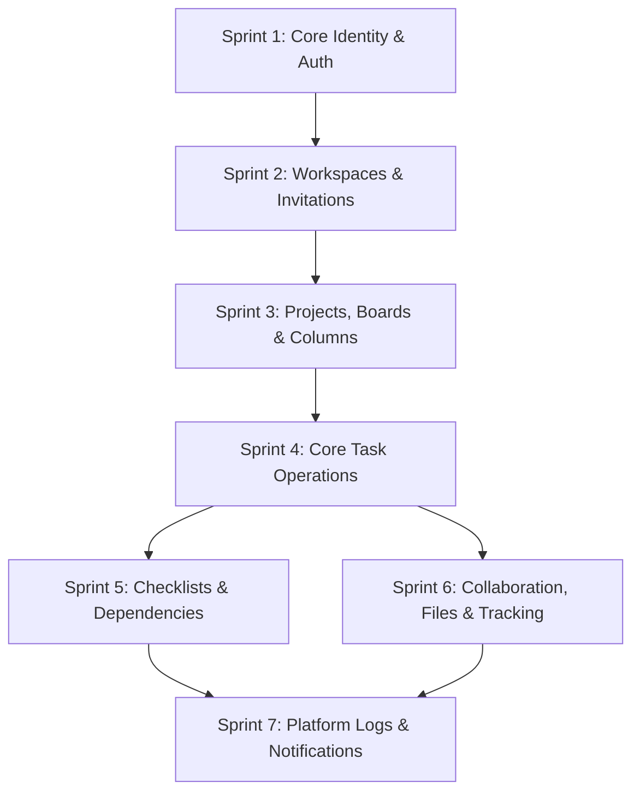

# TaskFlow — REST API Implementation Roadmap

This document outlines the phased implementation plan for the TaskFlow backend REST API. Sprints are sequenced logically by dependency graph, starting with core identity foundations and building up to collaborative modules and tracking features.

---

## Dependency Graph Overview

---

## Sprint 1: Identity & Authentication Foundation

*Foundational sprint defining database connections, user registration, token management pipelines, and user profile management.*

*   **Estimated Complexity**: Low
*   **Database Tables**: `user`, `role`, `permission`, `role_permission`, `refresh_token`
*   **Target Endpoints**:
    *   `POST /api/v1/auth/register`
    *   `POST /api/v1/auth/login`
    *   `POST /api/v1/auth/refresh`
    *   `POST /api/v1/auth/logout`
    *   `GET /api/v1/users/me`
    *   `PATCH /api/v1/users/me`

### Business Logic Highlights
1.  **Password Safety**: Enforce password requirements (min 8 chars, 1 uppercase, 1 digit) and hash credentials using bcrypt or Argon2 prior to storage.
2.  **Access Token Pipeline**: Access JWT holds a short lifetime (15 mins) and stores user claims.
3.  **Refresh Token Safety**: Generate a random secure cryptographic hash for the cookie; do not store the plain token. The token string is hashed via SHA-256 before inserting/comparing against database records. Revoke old refresh tokens immediately upon rotation (Token Rotation pattern).

### Suggested Testing Strategy
*   **Unit Tests**: Verify password validator, password hashing utilities, and JWT validation middleware.
*   **Integration Tests**:
    *   Assert duplicate registration returns `409 Conflict`.
    *   Assert invalid password login returns `401 Unauthorized`.
    *   Assert access token expiration forces token rotation call.
    *   Assert logouts revoke the token in the DB and clear the HTTP-Only cookie.

---

## Sprint 2: Workspaces & Invitations

*Introduces multi-tenant tenant isolation via Workspaces, workspace membership assignments, and external member invitation pipelines.*

*   **Dependency**: Sprint 1
*   **Estimated Complexity**: Medium
*   **Database Tables**: `workspace`, `workspace_member`, `user_role`, `invitation`
*   **Target Endpoints**:
    *   `POST /api/v1/workspaces`
    *   `GET /api/v1/workspaces`
    *   `PATCH /api/v1/workspaces/{workspaceId}`
    *   `DELETE /api/v1/workspaces/{workspaceId}`
    *   `GET /api/v1/workspaces/{workspaceId}/members`
    *   `DELETE /api/v1/workspaces/{workspaceId}/members/{userId}`
    *   `POST /api/v1/workspaces/{workspaceId}/invitations`
    *   `POST /api/v1/invitations/{token}/accept`

### Business Logic Highlights
1.  **Workspace Boundary Setup**: Workspace creation must atomicly register the workspace, add the user to membership, and assign the `owner` workspace-scoped role inside a single transaction.
2.  **Workspace Soft Deletion**: Mark `deleted_at = now()` on workspaces instead of hard deleting to preserve referential history.
3.  **Secure Invitations Acceptance**: Token accept requires verifying expiration limits, verifying current authenticated user's email matches invitation records, and inserting roles scoped under that workspace.

### Suggested Testing Strategy
*   **Integration Tests**:
    *   Confirm duplicate workspace slugs return `409 Conflict`.
    *   Assert only members with the `member:manage` permission can delete workspace members.
    *   Verify accepting a token registers user to `workspace_member` and configures a default `member` role entry.

---

## Sprint 3: Projects, Boards & Columns

*Implements workspace-scoped projects, Kanban boards, and column structures.*

*   **Dependency**: Sprint 2
*   **Estimated Complexity**: Medium
*   **Database Tables**: `project`, `project_member`, `board`, `board_column`
*   **Target Endpoints**:
    *   `POST /api/v1/workspaces/{workspaceId}/projects`
    *   `GET /api/v1/workspaces/{workspaceId}/projects`
    *   `PATCH /api/v1/projects/{projectId}`
    *   `DELETE /api/v1/projects/{projectId}`
    *   `POST /api/v1/projects/{projectId}/members`
    *   `DELETE /api/v1/projects/{projectId}/members/{userId}`
    *   `POST /api/v1/projects/{projectId}/boards`
    *   `GET /api/v1/projects/{projectId}/boards`
    *   `POST /api/v1/boards/{boardId}/columns`
    *   `PATCH /api/v1/columns/{columnId}`
    *   `DELETE /api/v1/columns/{columnId}`

### Business Logic Highlights
1.  **Project Key Formatting**: Project key (e.g. `TFB`) must be uppercase, alphanumeric, and unique to the workspace context.
2.  **Default Board Elements**: When a new board is registered, seed standard Kanban columns (`To Do`, `In Progress`, `Done`) inside the creation transaction.
3.  **WIP & Gapped Position Sequences**: Set columns positions with initial spacing (1000, 2000, 3000) to allow fluid drag-and-drop adjustments. Enforce WIP limits on additions.

### Suggested Testing Strategy
*   **Integration Tests**:
    *   Confirm duplicate project keys in same workspace return `409 Conflict`.
    *   Validate that non-members of a workspace are blocked from creating projects or accessing boards.
    *   Verify column order updates re-calculate correct sibling coordinate bounds without collision.

---

## Sprint 4: Core Task Operations

*Enables the main operational entity: Task cards, assignee listings, notification watcher registrations, and workspace category labels.*

*   **Dependency**: Sprint 3
*   **Estimated Complexity**: High
*   **Database Tables**: `task`, `task_assignee`, `task_watcher`, `label`, `task_label`
*   **Target Endpoints**:
    *   `POST /api/v1/columns/{columnId}/tasks`
    *   `GET /api/v1/boards/{boardId}/tasks`
    *   `PATCH /api/v1/tasks/{taskId}`
    *   `DELETE /api/v1/tasks/{taskId}`
    *   `POST /api/v1/tasks/{taskId}/assignees`
    *   `DELETE /api/v1/tasks/{taskId}/assignees/{userId}`
    *   `POST /api/v1/tasks/{taskId}/watchers`
    *   `DELETE /api/v1/tasks/{taskId}/watchers/{userId}`
    *   `POST /api/v1/workspaces/{workspaceId}/labels`
    *   `POST /api/v1/tasks/{taskId}/labels`
    *   `DELETE /api/v1/tasks/{taskId}/labels/{labelId}`

### Business Logic Highlights
1.  **Sequential Task Number Allocation**: Lock the target project via write lock queries prior to fetching the maximum `task_number` to prevent duplicate values under concurrent requests.
2.  **Completion Stamping**: When updating a task's `board_column_id` to a column configured with `is_done_column = true`, automatically stamp `completed_at = now()`. If moved back, reset to null.
3.  **Assignee Pre-requisite validation**: Block assigning users who are not registered in the project's member list.

### Suggested Testing Strategy
*   **Load / Concurrency Tests**: Run multi-threaded requests spawning tasks within the same project to confirm counter uniqueness functions correctly.
*   **Integration Tests**:
    *   Assert assignee updates trigger validation against the project member table.
    *   Assert moving tasks to a "Done" column writes the completed timestamp.

---

## Sprint 5: Checklists & Dependencies

*Introduces secondary task entities: multi-checklists, checklist items, and task-to-task dependency constraints with cycle validation.*

*   **Dependency**: Sprint 4
*   **Estimated Complexity**: High
*   **Database Tables**: `checklist`, `checklist_item`, `task_dependency`
*   **Target Endpoints**:
    *   `POST /api/v1/tasks/{taskId}/checklists`
    *   `POST /api/v1/checklists/{checklistId}/items`
    *   `PATCH /api/v1/checklist-items/{itemId}`
    *   `POST /api/v1/tasks/{taskId}/dependencies`
    *   `DELETE /api/v1/tasks/{taskId}/dependencies/{dependsOnId}`

### Business Logic Highlights
1.  **Dependency Loop Blocking**: When inserting a task dependency (`task A depends on task B`), run a depth-first search (DFS) through existing task links to ensure this does not create a circular dependency.
2.  **Checklist Integrity**: Deleting a task or a parent checklist container must execute cascading hard deletes on all associated checklist items.

### Suggested Testing Strategy
*   **Algorithm Tests (Unit)**: Test the cycle-detection module with mock graphs representing A->B, B->C, and attempting to add C->A (confirm loop exception).
*   **Integration Tests**:
    *   Verify checklist item checks write database updates correctly.
    *   Assert adding a self-dependency (task A depends on task A) is blocked via CHECK constraints.

---

## Sprint 6: Collaboration, Files & Tracking

*Adds collaborative comments, binary files attachments, work logging, and sprint lifecycle management.*

*   **Dependency**: Sprint 4
*   **Estimated Complexity**: Medium
*   **Database Tables**: `comment`, `file`, `task_attachment`, `sprint`, `time_log`
*   **Target Endpoints**:
    *   `POST /api/v1/tasks/{taskId}/comments`
    *   `PATCH /api/v1/comments/{commentId}`
    *   `DELETE /api/v1/comments/{commentId}`
    *   `POST /api/v1/files/upload`
    *   `POST /api/v1/tasks/{taskId}/attachments`
    *   `DELETE /api/v1/tasks/{taskId}/attachments/{attachmentId}`
    *   `POST /api/v1/tasks/{taskId}/time-logs`
    *   `GET /api/v1/tasks/{taskId}/time-logs`
    *   `DELETE /api/v1/time-logs/{timeLogId}`
    *   `POST /api/v1/projects/{projectId}/sprints`
    *   `GET /api/v1/projects/{projectId}/sprints`
    *   `PATCH /api/v1/sprints/{sprintId}`
    *   `DELETE /api/v1/sprints/{sprintId}`

### Business Logic Highlights
1.  **Threaded Comments**: Allow nested parent-child comment nodes (max 1 level depth) using `parent_comment_id`. Soft-delete user comments so conversation chains are preserved.
2.  **File Upload Processing**: Validate MIME types and storage allocations prior to writing metadata.
3.  **Active Sprint Limits**: Enforce that a project can have at most one active sprint. Verify database index locks when transitioning sprint status to `active`.

### Suggested Testing Strategy
*   **Integration Tests**:
    *   Confirm comment replies fail if referencing a non-existent parent comment ID.
    *   Assert that starting a sprint fails if another sprint is currently active in the same project.
    *   Verify time log insertions reject negative or zero duration values.

---

## Sprint 7: Platform Logs & Notifications

*Completes the core specification by tracking polymorphic activity audit logs across the workspace and executing user notifications.*

*   **Dependency**: Sprint 5, Sprint 6
*   **Estimated Complexity**: Medium
*   **Database Tables**: `activity`, `notification`
*   **Target Endpoints**:
    *   `GET /api/v1/workspaces/{workspaceId}/activities`
    *   `GET /api/v1/notifications`
    *   `PATCH /api/v1/notifications`

### Business Logic Highlights
1.  **Immutable Auditing**: Activity entries are write-once only. Do not expose `PUT`, `PATCH`, or `DELETE` endpoints for the activity logs.
2.  **Keyset / Cursor Pagination**: Force keyset decoding on all queries to prevent performance degradation under deep indexing offsets.
3.  **Notification Reads**: Allow bulk updates of notification state using arrays of UUID keys.

### Suggested Testing Strategy
*   **Integration Tests**:
    *   Verify actions (e.g. task re-assignment, column shift) create corresponding activity entries.
    *   Confirm cursor values are correctly serialized and parsed for nextPage execution.
    *   Assert users can only retrieve notifications addressed to their specific account.
